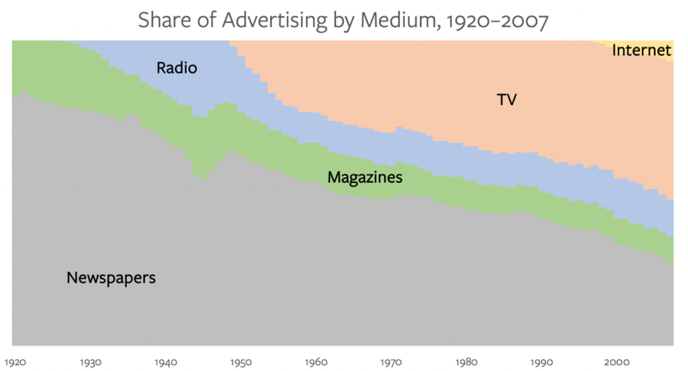

<h1 align="center">Welcome to Newzery 👋</h1>

  
  
  

> image : imagery : : news : newzery!

<!-- ### 🏠 [Homepage](https://newzery.herokuapp.com/) -->

### ✨ [Demo](https://www.youtube.com/watch?v=9hQ8bqcr1UQ)

### 📝 Features

- Convert any web article into a short video.

- Video length of your choice.

- End to end, send URL to the messenger bot, and get the video!

### 💡 Motivation

    

Assuming that advertising revenue is a reasonable proxy for attention, it turns out that humans like pictures more than text, and moving pictures most of all; so it has gone on the Internet.[[source](https://stratechery.com/2020/the-tiktok-war)]

### 🚀 Building

- Clone this repository : `git clone https://github.com/rohitner/newzery`.

- Install the dependencies : `pip install -r requirements.txt`.

- Create a facebook page, add the messenger plugin to this page with your [developer account](https://developers.facebook.com/) to generate the access token. Save this token to `ACCESS_TOKEN` environment variable.

- Download the [ngrok binary](https://ngrok.com/download) and run `./ngrok http 5000`

- Save a string of your choice as `VERIFY_TOKEN` environment variable.

- Run `python bot.py`

- Configure the webhook: Enter the https URL of the ngrok forwarded port as the callback URL, and set verify token to the value in `VERIFY_TOKEN`.

- Let the callback URL be verified, and you are ready to roll.

## Author

👤 **Rohit Ner**

* LinkedIn: [@rohitner](https://linkedin.com/in/rohitner)
* Github: [@rohitner](https://github.com/rohitner)
* Twitter: [@rohitner](https://twitter.com/rohitner)

## Acknowledgements

- Hat tip to anyone whose code was used.

## 📝 License

Copyright © 2020 [Rohit Ner](https://github.com/rohitner). 
This project is [GPL](https://github.com/rohitner/newzery/blob/master/LICENSE) licensed.
